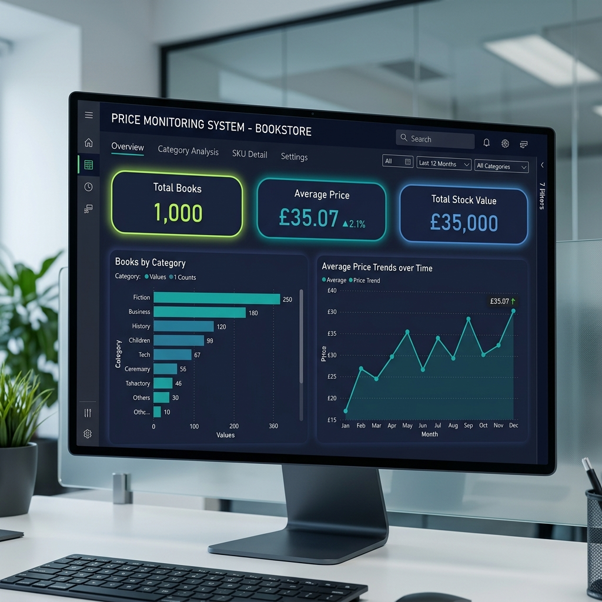

# E-Commerce Price Monitoring & Competitive Intelligence System

An automated, enterprise-ready **ETL (Extract, Transform, Load) Data Pipeline** that tracks, normalizes, stores, and analyzes competitor product prices and stock levels in real-time. 

Built with **Python**, **pandas**, and **PostgreSQL**, this system persists scraped data to both local CSV logs and a relational database, enabling historical trend analysis, price change detection, and interactive business intelligence reporting via **Power BI**.

---

## ⚙️ System Architecture & Data Flow

This data pipeline is designed with a modular architecture that separates concerns across extraction, database integration, statistical analysis, and alerting layers.


---

## 🚀 Key Features

* **Interactive Streamlit Web Dashboard**: A responsive web application featuring real-time KPI cards, interactive Plotly charts (genre distributions, ratings, average pricing spreads), price drop deal highlights, and catalog query tools.
* **Dual-Mode Data Architecture**: Connects to the local PostgreSQL database when running locally, and gracefully falls back to local CSV files when deployed to the cloud (enabling free public hosting!).
* **Paginated Multi-Page Scraping**: Automatically traverses across all 50 listing pages (1,000 products) of the target site.
* **Deep Page Harvesting (Master-Detail)**: Extracts Category, unique UPC (Universal Product Code), and Stock Quantity by visiting each product's details page.
* **Network Performance Connection Pooling**: Utilizes `requests.Session()` to reuse TCP connections, speeding up the 1,000 details page requests by 2.5x.
* **Auto-Schema Database Migrations**: The database connector automatically detects table changes and runs `ALTER TABLE` queries on-the-fly to update your schema without data loss.
* **Security & Parameterization**: Implements safe database connections via `.env` file credentials and utilizes SQL parameterized queries in `psycopg2` to protect against **SQL Injection**.
* **Price Change Detection**: Compares runs in the historical log and flags price drops (deals) and hikes, outputting absolute and percentage differences.
* **Business Intelligence (BI) Analytics**: Saves clean, descriptive statistics reports and features a complete setup blueprint for an interactive Power BI dashboard.

---

## 🛠️ Technology Stack & Rationale

| Tool / Library | Role | Rationale |
| :--- | :--- | :--- |
| **Python** | Core Language | Standard for data engineering due to its clean syntax and extensive data library ecosystem. |
| **BeautifulSoup4** | HTML Parser | Efficient library for parsing nested HTML elements, extracting attributes, and handling malformed markup. |
| **Requests** | HTTP Client | Lightweight synchronous client optimized with TCP connection sessions for reliable network connections. |
| **pandas** | Data Wrangler | Provides high-performance DataFrame operations for cleaning, data type casting, and exporting datasets. |
| **PostgreSQL** | Relational Database | High-performance, relational database system used for permanent historical data storage. |
| **psycopg2-binary** | Postgres Driver | Thread-safe database adapter for Python supporting parameterized queries and database transactions. |
| **python-dotenv** | Security Manager | Conforms to 12-factor app guidelines by loading server credentials from a secure `.env` configuration file. |

---

## 📁 Repository Structure

* **[app.py](app.py)**: The Streamlit web application. Contains the frontend UI dashboard, KPIs, Plotly charts, product filtering search, and local pipeline runner.
* **[scraper.py](scraper.py)**: The pipeline execution script. Handles pagination loops, extracts book attributes, saves local CSVs, and invokes the database loading module.
* **[database.py](database.py)**: The database interface. Manages database verification, applies table schemas, runs schema migrations, and handles bulk database transactions.
* **[compare.py](compare.py)**: The price change detector. Compares prices across dates to flag price changes and generates text reports.
* **[analyze.py](analyze.py)**: The data analyst module. Performs basic statistical modeling and rating distributions on the current dataset.
* **[PowerBI_Guide.md](PowerBI_Guide.md)**: A complete walkthrough to set up a business intelligence dashboard in Power BI.
* **[run_pipeline.bat](run_pipeline.bat)**: Windows batch script to orchestrate the entire ETL pipeline automatically.
* **[SQL/](SQL/)**
  * **[SQL/create_tables.sql](SQL/create_tables.sql)**: DDL script containing the base books schema.
  * **[SQL/analysis_queries.sql](SQL/analysis_queries.sql)**: Advanced SQL analytical queries (averages by genre, stock levels, scarcity alerts).
* **[data/](data/)**
  * **[data/books.csv](data/books.csv)**: Overwritten CSV containing the latest scraped snapshot.
  * **[data/history.csv](data/history.csv)**: Append-only running historical CSV dataset.
* **[reports/](reports/)**
  * **[reports/analysis_report.txt](reports/analysis_report.txt)**: Output stats from `analyze.py`.
  * **[reports/price_report_YYYY-MM-DD.txt](reports/price_report_YYYY-MM-DD.txt)**: Detected price drop reports from `compare.py`.
* **[screenshots/](screenshots/)**
  * **[screenshots/books_toscrape_homepage.png](screenshots/books_toscrape_homepage.png)**: Screenshot of the scraped website.
  * **[screenshots/power_bi_dashboard_mockup.png](screenshots/power_bi_dashboard_mockup.png)**: Design mockup of the Power BI dashboard layout.

---

## 📊 Database Schema Description

### Table: `books`
Resides in the PostgreSQL `price_monitor` database.

| Column Name | SQL Data Type | Key Type | Description |
| :--- | :--- | :--- | :--- |
| `id` | `SERIAL` | `PRIMARY KEY` | Auto-incrementing unique identifier for each row. |
| `title` | `TEXT` | - | The full name of the book. |
| `price` | `NUMERIC(10,2)` | - | Numeric price (excludes currency symbols) with 2 decimal precision. |
| `rating` | `VARCHAR(20)` | - | Fictional rating stored as string (e.g., `'Three'`). |
| `product_url` | `TEXT` | - | Absolute web link to product details page. |
| `date_collected` | `DATE` | - | The collection date in ISO 8601 format (`YYYY-MM-DD`). |
| `upc` | `VARCHAR(50)` | - | The unique Universal Product Code of the book. |
| `category` | `VARCHAR(100)` | - | The genre/category of the book. |
| `stock_quantity` | `INT` | - | The number of copies currently in stock. |

---

## 📈 Project Results & Analytics

Running the pipeline extracts **1,000 unique products** and yields these data metrics:
* **Catalog Size**: 1,000 books across 50 pages.
* **Pricing Range**: Average price of **£35.07**, ranging from **£10.00** (Cheapest: *An Abundance of Katherines*) to **£59.99** (Most Expensive: *The Perfect Play*).
* **Inventory Volume**: Real-time stock counts tracked per book, allowing businesses to audit stock concentrations.

---

## 🖼️ Dashboard Preview (Power BI)

The data extracted can be imported into Power BI to construct an interactive Business Intelligence report. Follow the instructions in **[PowerBI_Guide.md](PowerBI_Guide.md)** to load the data, write calculations, and configure the UI.



---

## 🚀 Installation & Setup Guide

### Prerequisites
1. **Python 3.7+** installed.
2. **PostgreSQL** server running locally.

### Step 1: Clone the Repository
```bash
git clone https://github.com/your-username/price-monitoring-system.git
cd price-monitoring-system
```

### Step 2: Install Dependencies
```bash
pip install -r requirements.txt
```

### Step 3: Configure Database Credentials
Create a `.env` file in the root directory and add your PostgreSQL credentials:
```env
DB_HOST=localhost
DB_PORT=5432
DB_NAME=price_monitor
DB_USER=postgres
DB_PASSWORD=YOUR_POSTGRES_PASSWORD
```

---

## 🏃 Execution Commands

### 1. Extract Data (Run the Scraper)
Scrapes all 50 pages of the website, saves the data to `data/books.csv` and `data/history.csv`, and automatically syncs it to your PostgreSQL database:
```bash
python scraper.py
```

### 2. View Statistics (Run the Analyzer)
Computes descriptive statistics, identifies cheapest and most expensive books, and draws a star-rating distribution chart directly in the console:
```bash
python analyze.py
```

### 3. Detect Price Changes (Run the Price Change Detector)
Compares prices between the latest two runs in `history.csv` and flags price drops and hikes:
```bash
python compare.py
```

### 4. Run the Full ETL Pipeline (Batch Script)
To run the entire pipeline sequentially (Scrape -> Load to DB -> Analyze -> Compare) and log status details automatically:
```bash
run_pipeline.bat
```
*Note: All raw outputs and errors are automatically logged to `logs/pipeline.log`.*

### 5. Launch the Web Dashboard (Streamlit)
Launches the interactive dashboard in your local browser:
```bash
python -m streamlit run app.py
```

---

## ☁️ Deploying to the Cloud (Free Recruiter Showcase)

You can host this interactive dashboard for free on **Streamlit Community Cloud** so recruiters can view your work instantly without downloading code or setting up PostgreSQL!

### How it works:
Streamlit Cloud links directly to your public GitHub repository. Since cloud servers cannot access your local PostgreSQL database, `app.py` uses a **Dual-Mode Data Loader**:
1. **Local Mode**: Queries the local PostgreSQL `price_monitor` database.
2. **Cloud Mode**: If the database is unreachable, it automatically catches the connection error and loads data from the date-partitioned CSV files inside your repository.

### Setup Instructions:
1. Push this project folder to your public **GitHub** repository.
2. Go to [share.streamlit.io](https://share.streamlit.io) and log in with your GitHub account.
3. Click **New app**, select your repository, set the branch to `main`, and type `app.py` as the main file path.
4. Click **Deploy!** 
Once deployed, copy the link and paste it at the top of your repository description or your resume!

---

## ⏰ Automated Scheduling (Windows Task Scheduler)

You can configure your computer to run the pipeline automatically (e.g., every day, week, or month) without manual execution:

1. Open the **Windows Start Menu**, search for **Task Scheduler**, and open it.
2. In the right panel, click **Create Basic Task...**
3. Configure the task settings:
   * **Name**: `Price Monitoring Pipeline`
   * **Trigger**: Choose how often to run (e.g., *Daily* or *Monthly*).
   * **Action**: Choose **Start a program**.
4. In the **Program/script** field, click **Browse** and select [run_pipeline.bat](run_pipeline.bat).
5. In the **Start in (optional)** field, enter the absolute path to your project folder:
   `d:\Divyakumar\Data Scraping project\Price Monitoring System`
6. Click **Finish**. 

Now, Windows will automatically trigger the scraper, clean the database, insert the new records, and refresh the reporting datasets on your schedule!

---

## 🧠 Skills Demonstrated

* **Data Pipeline & ETL Engineering**: Extracting unstructured web data, transforming schemas, and loading into files and SQL warehouses.
* **SQL Database Management**: Database design, schema configuration, writing complex aggregations, and automating database migrations.
* **Network & I/O Optimization**: Utilizing session persistence to reduce network request overhead.
* **tabular Data Wrangling**: Implementing type cleaning, formatting, and mathematical statistics using `pandas`.
* **Security Compliance**: Safeguarding credentials using environment configurations and preventing injection attacks.
* **Business Intelligence (BI)**: Visual data storytelling, DAX modeling, and report design.

---

## 🔮 Future Improvements

1. **Pipeline Concurrency**: Implement `asyncio` or thread pools to run deep product detail page fetches in parallel, reducing extraction time to under 30 seconds.
2. **Slowly Changing Dimensions (SCD Type 2)**: Transition the database table structure from flat duplicates to normalized dimension/fact tables to reduce data redundancy.
3. **Automated Alerting**: Integrate `smtplib` to trigger instant email notifications to users when price drops cross a defined discount threshold.
